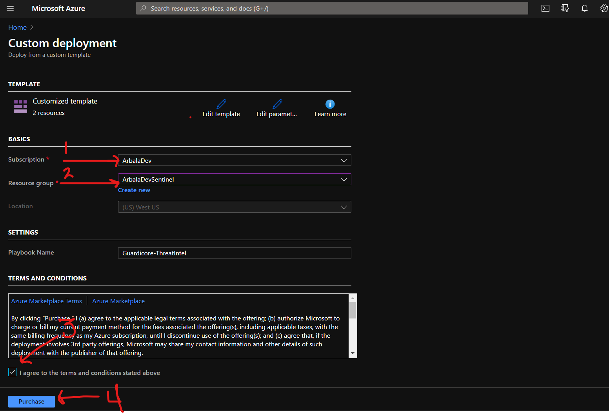
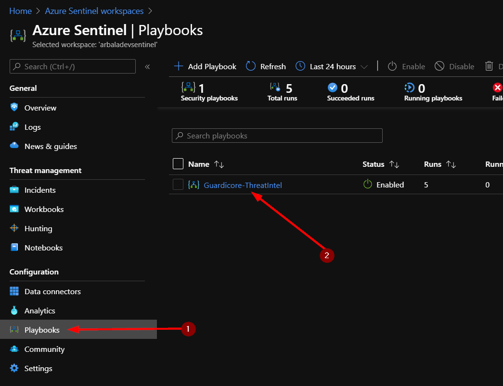
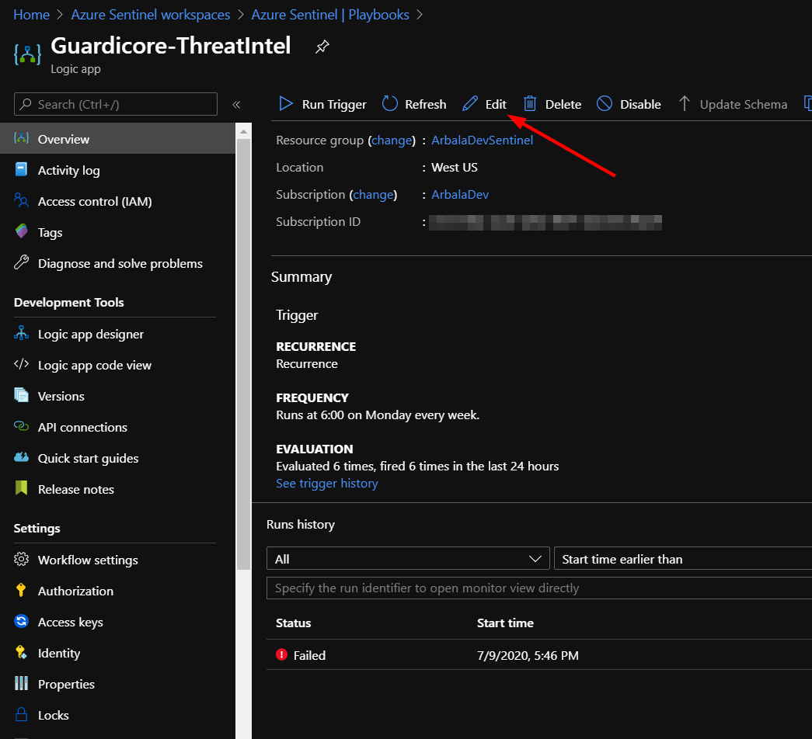
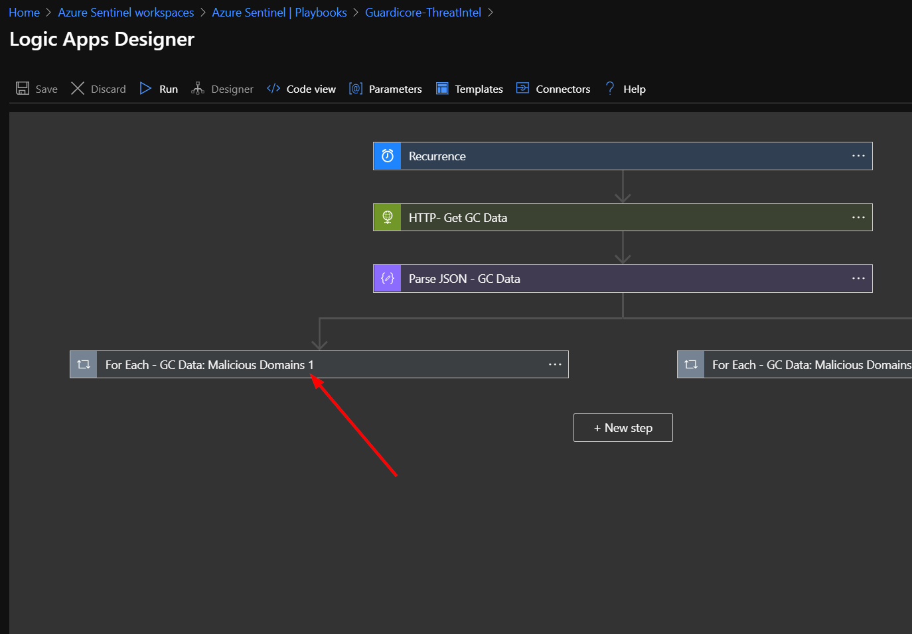
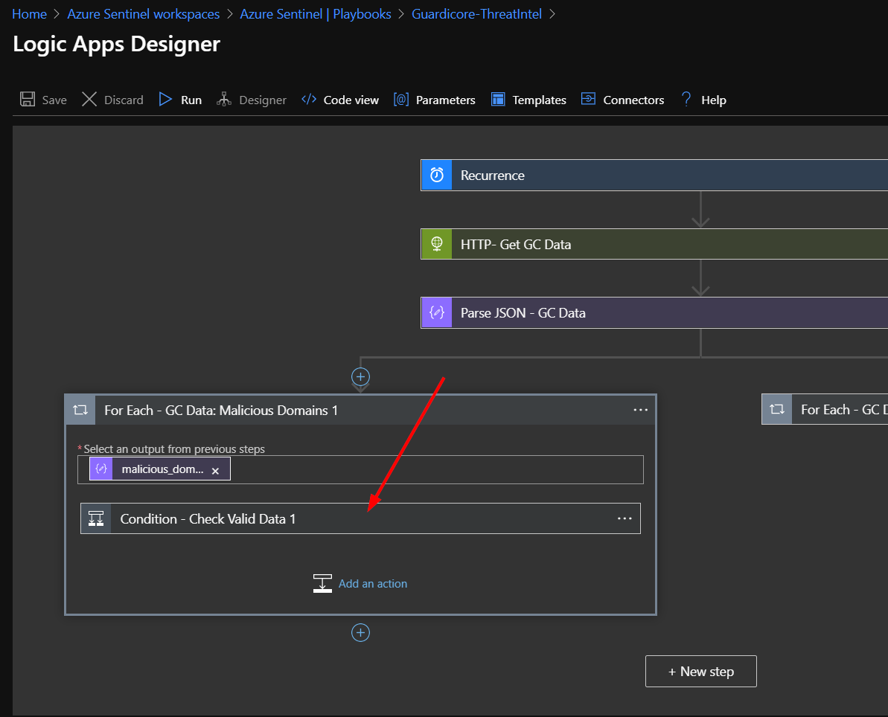
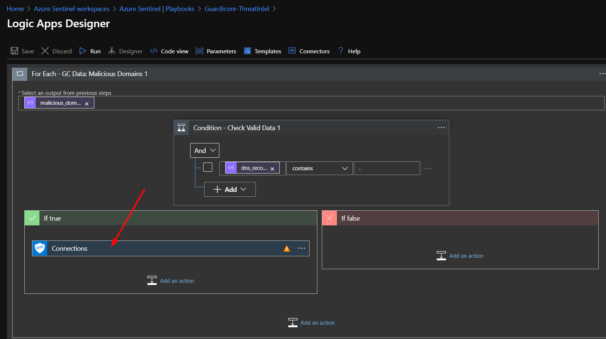
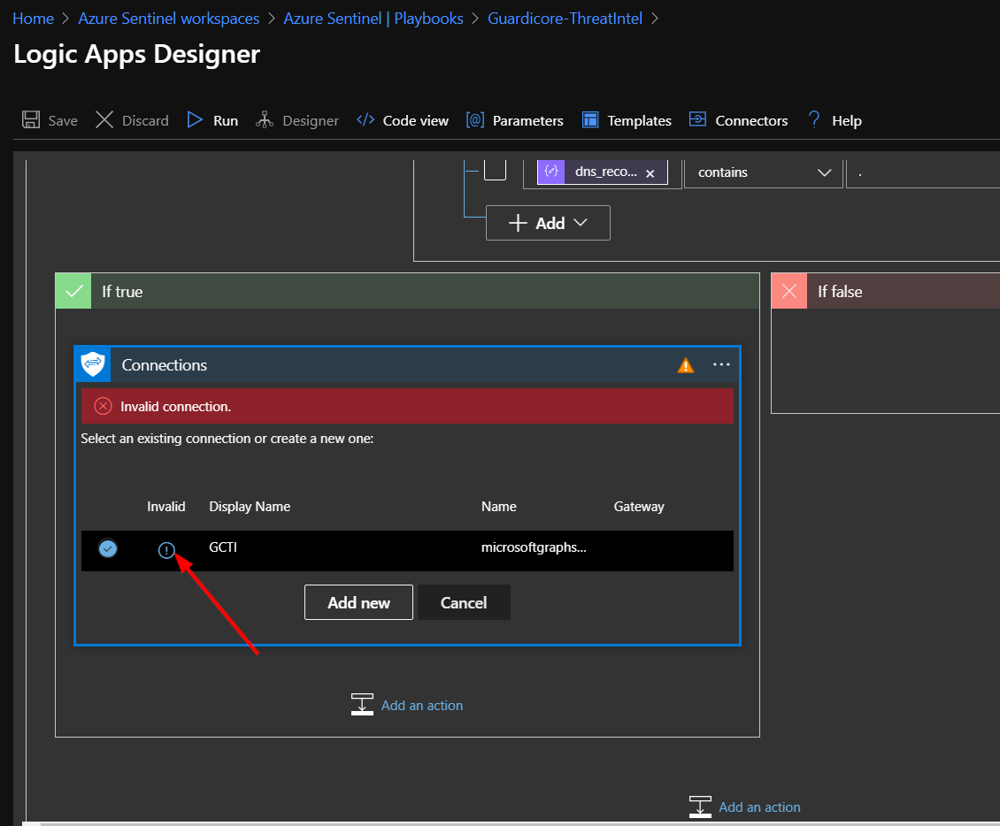
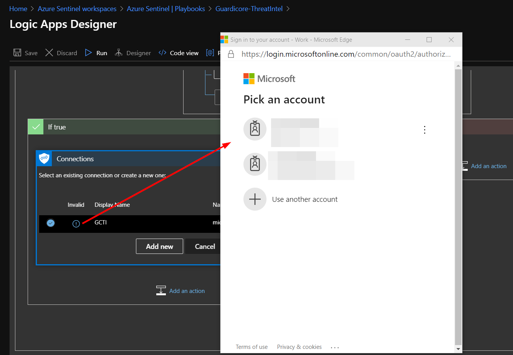
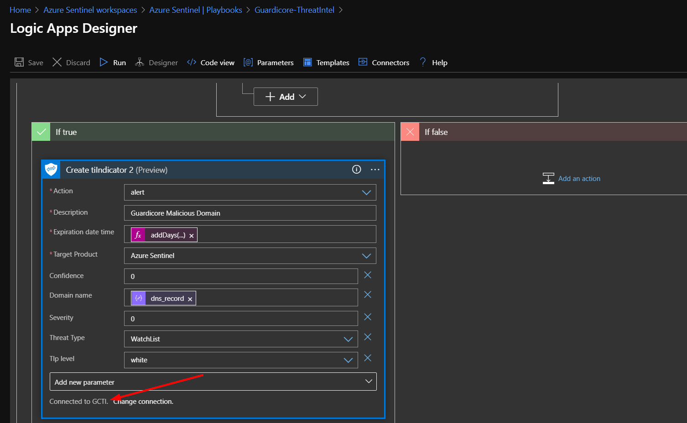

# Integrating Guardicore Threat Intelligence into Azure Sentinel

Author: Accelerynt

For any technical questions, please contact info@accelerynt.com

       

This playbook will pull the domain names and IPs from the threat intelligence that Guardicore shares every Sunday. It will create Azure Sentinel Threat Intelligence Indicators with the information gathered and send it to the tiIndicators API. This playbook is configured to run every Monday morning at 6:00 AM EST.

The Guardicore Cyber Threat Intelligence Service [Feed](https://threatintelligence.guardicore.com/download-guardicore-cyber-threat-intelligence-data) is part of the their [Cyber Threat Intelligence Platform](https://threatintelligence.guardicore.com/).

#
### Deployment                                                                                                         
                                                                                                        
To configure and deploy this playbook:

Open your browser and ensure you are logged into your Azure Sentinel workspace. In a separate tab, open the link to our playbook on the Accelerynt Security GitHub Repository:

https://github.com/Accelerynt-Security/Guardicore-ThreatIntel

       

Click the “**Deploy to Azure**” button at the bottom and it will bring you to the Custom Deployment Template.

In the **Project Details** section:

* Select the “**Subscription**” and “**Resource Group**” from the dropdown boxes you would like the playbook deployed to.  

In the **Instance Details** section:   

* **Playbook Name**: This can be left as “Guardicore-ThreatIntel” or you may change it.  

Towards the bottom, click on “**Review + create**”. 

Once the resources have validated, click on "**Create**".

The resources should take around a minute to deploy. Once the deployment is complete, you can expand the "**Deployment details**" section to view them.
Click the one corresponding to the Logic App.

Click on the “**Edit**” button. This will bring us into the Logic Apps Designer.

Click on the bottom left bar labeled “**For Each - GC Data: Malicious Domains 1**”. 

Click on the bar labeled “**Condition - Check Valid Data 1**”. 

Click on “**Connections**”. This step uses a connection created during the deployment of this playbook. Before the playbook can be run, this connection will either need to be authorized in this step, or an existing authorized connection may be alternatively selected.

To validate the connection created for this playbook, expand the "**Connections**" step and click the exclamation point icon next to the name matching the playbook.

When prompted, sign in to validate the connection.       

You should see the that the “**Create tiIndicator 2**” box has updated and displays “**Connected to GCTI**.” Click the X to close the Logic App Designer. There is no need to click a save button. 

This process will not need to be repeated for the right hand branch. 

# Developer's Note:
The branching for the same outer loops is necessary because not all Guardicore domains and IP addresses are in a format Microsoft Graph will accept as valid. 
The branching allows a domain name and its associated IP addresses to be ingested separately.
This way, an invalid domain name will not negate its associated valid IP addresses, or vice versa.
